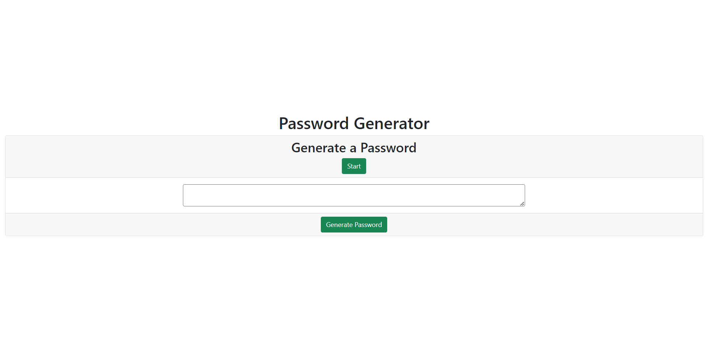

# Password Generator Application

This is a simple web application that allows users to generate a random password based on their specified criteria. The application runs in the browser and features dynamically updated HTML and CSS powered by JavaScript code.

## Overview

This application provides an easy way for users to create secure and random passwords. It includes the following features:

- Password length customization (between 8 and 128 characters)
- Character type selection (lowercase, uppercase, numeric, special characters)
- Validation for each input
- Password generation based on user criteria

## Instructions

1. Click the "Start" button to start the process.
2. Respond to the prompts to set the desired password criteria.
3. Make sure to input a valid password length (between 8 and 128 characters) and select at least one character type.
4. Once the prompts are answered, click the "Generate Password" button to display the password created based on the prompts selected criteria.

## Getting Started

To get a copy of this project up and running on your local machine, follow these steps:

1. Clone the repository:

   ```bash
   git clone https://github.com/rober-web/password-generator.git

## To Access


[View my Password Generator App](https://rober-web.github.io/Password-Generator/)

